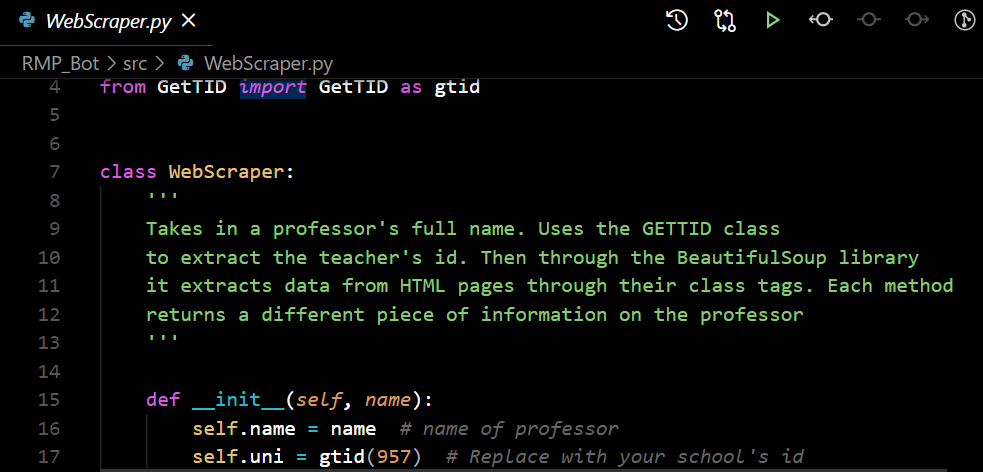
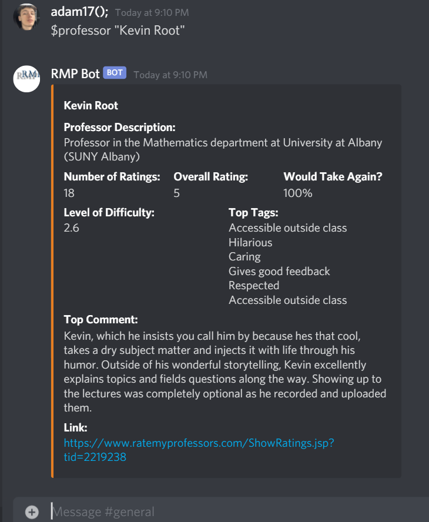
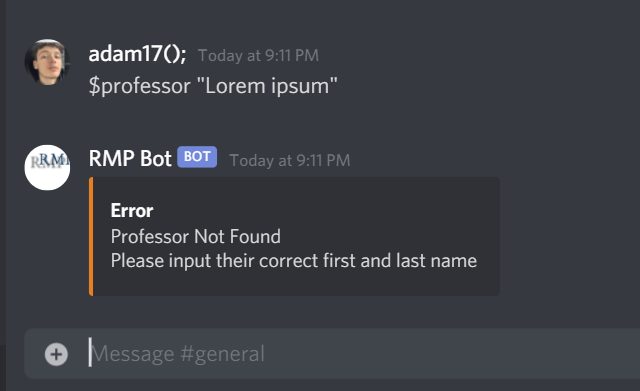

# RateMyProfessor_Bot

## Description:
Takes in the professor's full name, scraps web pages using json and html text using the BeautifulSoup Module, returns information on the professor. It also has another feature which scraps a web page and randomly outputs a joke. Used for Discord in this instance, but can be used for other platforms. 

## Usage:
The scripts include several python docstrings. The method names and code was designed to be easily understood and self-explanatory. Anyhow, you may tinker with the code so that it fits your need. For simple discord installation, add your token to the bot.py file. The scripts are made to be generic, any student from any school can use it, simply change the id to your school's id as shown below:

## Commands:
The following commands are currently present for the discord bot, you may tinker with the scripts and add more commands or use the scripts for a different platform.

### $professor "Full Name"

#### If the professor's name doesn't exist

### $laugh

